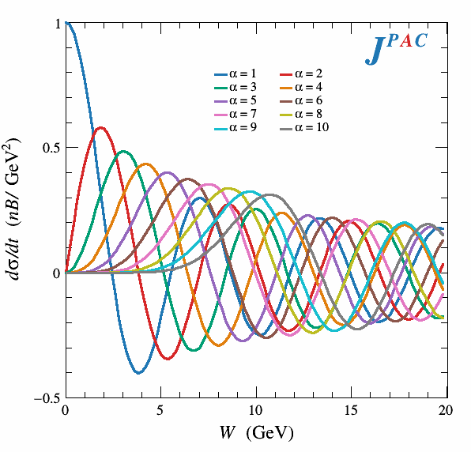
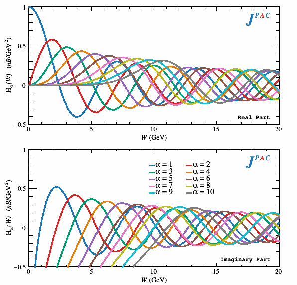
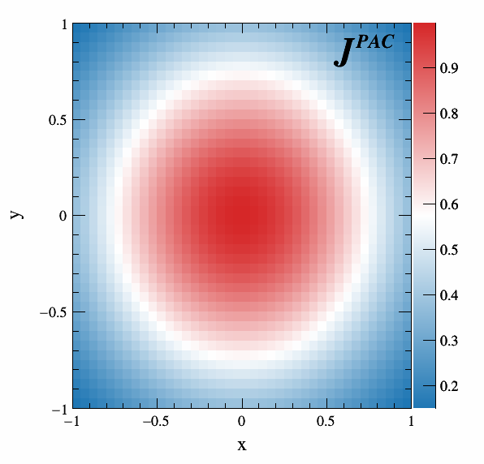

# jpacStyle
<p align="center">
  
</p>

Library for making plots in C++/[ROOT](https://root.cern/) for the JPAC Collaboration.

Compile the library with the following command:
```bash
mkdir build
cd build
cmake ..
make
```
This will make `libJpacStyle.a` in the build directory which can be added to `$PATH` for access to the header files.

Alternatively, clone this repo into the working directory of the project you intend to link (or add it as a `git submodule`) and add the following lines to `CMakeList.txt`:
```cmake
# BUILD THE PLOTTING LIBRARY
include_directories("jpacStyle/include")
include_directories("jpacStyle/src")
file(GLOB_RECURSE PLOTINC "jpacStyle/include/*.hpp")
file(GLOB_RECURSE PLOTSRC "jpacStyle/src/*.cpp")
add_library( JpacStyle ${PLOTINC} ${PLOTSRC} )
```
then link to any executable with
```cmake
target_link_libraries( $MY_EXE JpacStyle)
```
For a full example of this see [vector_photoproduction](https://github.com/dwinney/vector_photoproduction). For questions email: *dwinney@iu.edu*.

### [jpacGraph1D](./include/jpacGraph1D.hpp)
This object allows you to easily make one-dimensional plots according to the style and with minimal ROOT syntax.

Basic usage is:
```cpp
// Initialize the object
jpacGraph1D* my_1Dplotter = new jpacGraph1D();

// Add x and f(x) data in a vector and a string for the legend label
my_1Dplotter->AddEntry(vector<double> x, vector<double> fx, string legendTitle);

// Plot to file
my_1Dplotter->Plot(string filename);
```
All of ROOT's supported output formats are available as extentions in the filename (.eps, .pdf, .png, etc.) for a full list see ROOT documentation on [`TPad::Print()`](https://root.cern.ch/doc/master/classTPad.html).

You can add multiple curves by calling `AddEntry()` multiple times (up to 10, because we only have 10 colors defined).

<p align="center">
  
  
</p>

Only one `jpacGraph` object can be active at a time because of name collisions with ROOT canvases. To plot new output from an existing `jpacGraph1D` use:
```cpp
my_1Dplotter->ClearData();
```

Additional customization can be set up with the previous functions before plotting:
```cpp
// Manually place location of the legend with relative coordinate of the bottom left vertex x and y
my_1Dplotter->SetLegend(double xCord, double yCord);

// Or disable the Legend entirely with
my_1Dplotter->SetLegend(false);

// Add axis labels
my_1Dplotter->SetXaxis(string xLabel);
my_1Dplotter->SetYaxis(string yLabel);

// The above will set the range of the plot based on the first
// Entry added. To manually fix the range use optional parameters:
my_1Dplotter->SetXaxis(string xLabel, double xMin, double xMax);
my_1Dplotter->SetYaxis(string yLabel, double yMin, double yMax);

// Toggle logarithmic axes
my_1Dplotter->SetYlog(bool key);
my_1Dplotter->SetXlog(bool key);
```
Axes labels are TLatex objects and thus follow the same syntax for mathematical symbols (see [doc](https://root.cern.ch/doc/master/classTLatex.html)). For an example script using this object see [bessel.cpp](./examples/bessel.cpp).

<p align="center">
  
</p>

### [jpacGraph1Dc](./include/jpacGraph1Dc.hpp)
This is operates nearly identical to the above but allows for plotting complex valued function defined on the real line. All the functions available in `jpacGraph1D` are present here except all with the possibility of accepting complex vectors when adding entries:
```cpp
jpacGraph1Dc* my_1Dcplotter = new jpacGraph1Dc();

// Adding complex-valued entry
my_1Dcplotter->AddEntry(vector<double> x, vector<complex<double>> fx, string legendTitle);

// There are now 2 y-axes for the real and imaginary parts
// These are independently customizable with:
my_2Dplotter->SetYRealaxis(string yLabel, double yMin, double yMax);
my_2Dplotter->SetYImagaxis(string yLabel, double yMin, double yMax);
```
Output is the Real and Imaginary parts plotted seperately in the same file (See [hankel.cpp](./examples/hankel.cpp)).

<p align="center">
  
</p>

### [jpacGraph2D](./include/jpacGraph2D.hpp)
This object allows yo uto make two-dimensional plots according to JPAC color scheme with minimal ROOT interfacing.

Basic usage is even easier than above since only one function is plottable at once:
```cpp
// Initialize
jpacGraph2D* my_2Dplotter = new jpacGraph2D();

// Add in the x, y, and z data as vectors
my_2Dplotter->AddData(vector<double> x, vector<double> y, vector<double>) z;
```
Most of the customization functions above are available here as well.

See the example executable [2dgaussian.cpp](./examples/2dgaussian.cpp).

<p align="center">
  
</p>


### importStyle.C
Alternatively if you want to make the plots manually through ROOT, this macro imports the jpacStyle and jpacColors. Also adds a function `AddLogo()` which adds the collaboration logo in the upper right corner.
Simply load when opening ROOT:
```bash
root -l importStyle.C
```
